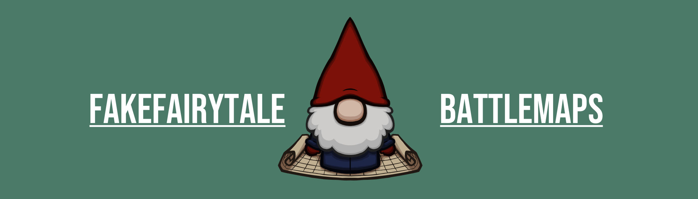
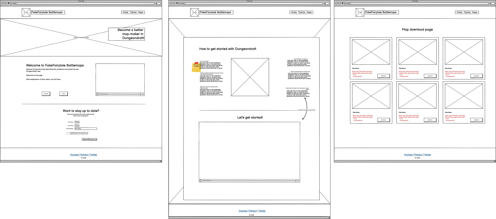
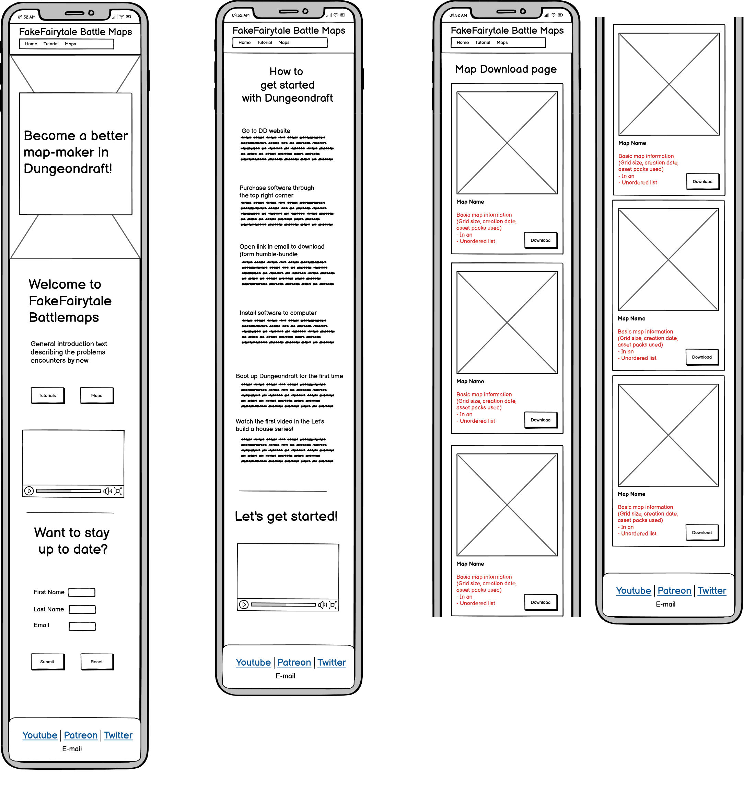
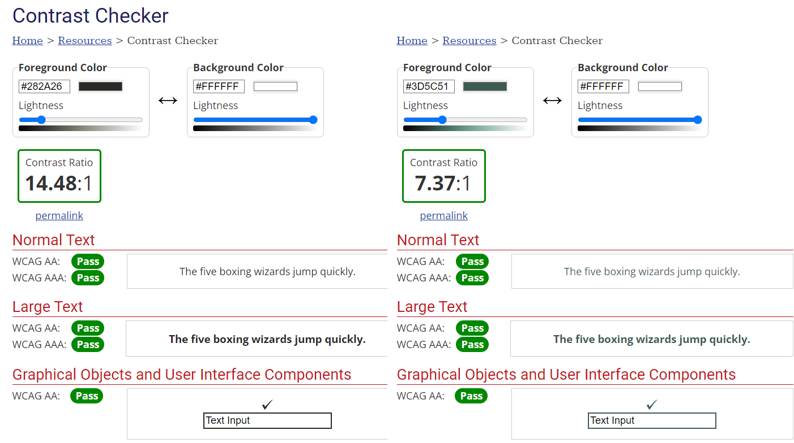
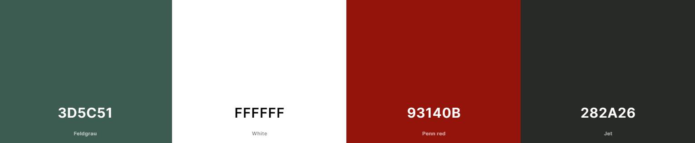
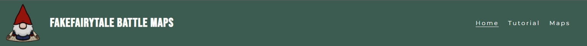
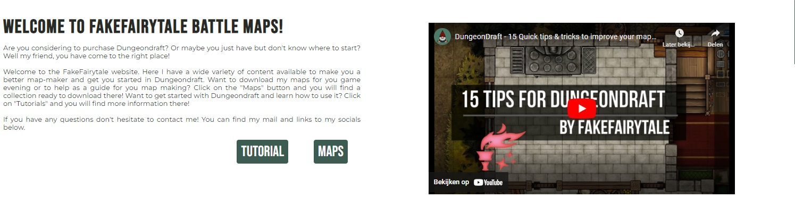
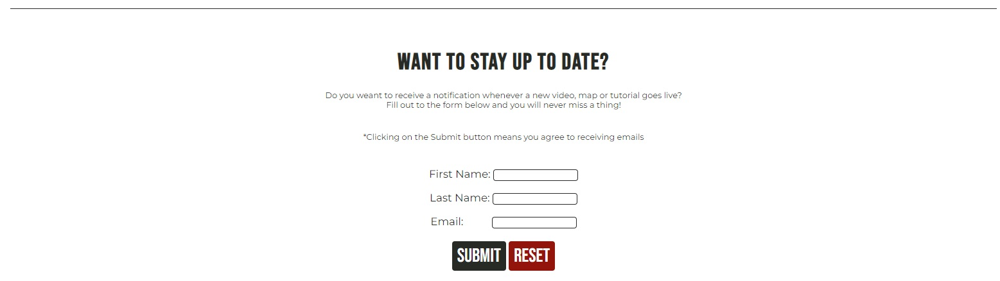

---------------------------------------------------------------------------------------------------------------------
# FakeFairytale Battle Maps

FakeFairytale Battle Maps is a Youtube channel and content creator in the digital map-making space. It is specifically geared towards user of the DungeonDraft( Henceforth referred to as "DD") software, or those who are in the consideration process of purchasing DD. The website is designed to familiarize people with the FakeFairytale YouTube Channel, Tutorials and Maps and offers content on these three respective fields. FakeFairytale Battle Maps will help people find their way into the world of digital map making using DD.

*Hello and welcome! My name is FakeFairytale and today I'm going to guide you through the website of* <a href="https://wouter-it.github.io/maps-tutorial/" target="_blank">*FakeFairytale Battle Maps*</a>.

# Contents

TO BE FILLED IN

# User Experience (UX)
- As a visitor I want to immediatly understand the purpose of the website upon loading. 
- As a visitor I want to be able to navigate through the site conveniently.
- As a visitor I want to see what kind of content FakeFairytale creates.
- As a visitor I want to have material to improve my map-making skills at my disposal.
- As a visitor I want to know how to purchase DD.
- As a visitor I want to be able to contact FakeFairytale.
- As a visitor I want to be able to find more videos & tutorials.
- As a visitor I want to download maps made by FakeFairytale.

[Back to top](<#contents>)

## Wireframes

The Wireframes for FakeFairytale Battle Maps were made using [Balsamiq](https://balsamiq.com) as the UI proved to be intuitive and easy to grasp. There are wireframes for two separate devices; Full-Screen and Mobile.
The final design of the website varies slightly from the wireframes in some regards as during the process it was discovered the design could be simplified without the loss of clarity.

[Back to top](<#contents>)

## Site Structure

The FakeFairytale website has 4 differen pages. The [home page](index.html) as default page to greet visitors, the [confirmation screen](confirm-signup.html) that people see when they fill in the sign-up to newsletter form on the home page, the [tutorial](tutorial.html) where people can learn how to install DD and watch the first tutorial video on the software, and the [maps](maps.html) page wehere people can view and download maps made by FakeFairytale.

Right underneath the home page introduction text there are also two quick navigation buttons that will take the visitor directly to either the tutorial or maps page based on their input and reason for visiting the website.

[Back to top](<#contents>)

## Design & Color Scheme

### Typography
The typography that were chosen for the project were <a href="https://fonts.google.com/specimen/Bebas+Neue" target="_blank">Bebas Neue</a> for the headers and <a href="https://fonts.google.com/specimen/Montserrat" target="_blank">Montserrat</a> with a fall-back on sans-serif as body text. Bebas Neue was chosen because it already was the main font of the FakeFairytale brand and it suits the role as header well. It is described ad bold and draws in the eyes to the headers to help guide a visitor through the page. Montserrat was chose as body and navigation text based on the recommendation from <a href="https://typ.io/fonts/bebas_neue#:~:text=Bebas%20Neue%20is%20a%20sans,Calluna%2C%20Avenir%20and%20Playfair%20Display." target="_blank">Typ.io</a> as a suitable match. It also has a clean look that'se asy to read and thus suited for explanatory texts.

### Color Palette

The color scheme chosen is based on the FakeFairytale brand and the colors it employs in it's YouTube channel and logo. However, as those colors were not necessarily designed for the use of a website some minor changes have been made to address that. The original green-grey color has been darkened slightly to increase contrast. Alternatively the red has been derived from the Gnomes Hat in the logo, and the slightly off-black color has been chosen to better match the soft colors already in the palate.

[Back to top](<#contents>)

# Features
### Logo & Navigation (All-pages)
- Located at the very top of every page is a fully responsive navigation menu that allows for easy navigation across the site. 
- The FakeFairytale gnome logo is also equipped with a link that returns the user to the home page, as is common on many websites. 
- The logo image disappears on smaller devices as to not take up too much space when limited is available.

### Hero (Home-page)
- Located just below the navigation is an image and welcome message. The image helps set the tone for the page and is one of the most popular maps made by FakeFairytale. It is blurred out as to no distract form the message.
- The welcome message immediately states the value the website provides. It is aimed at making you a better map-maker and helps the visitor understand the intend and purpose of the website.

### About (Home-page)
- A two collumn about section introduces the visitor to the FakeFairytale brand.
- The left-hand text column states the core problems the visitor is experiencing in order captivate them and capture their attention. It then proceeds to introduce the brand to those unfamiliar.
- Two quick navigation buttons help guide the visitor to their destination. They are designed to specifically help the visitor that already knows what they are visiting the page for.
- The right-hand-side video introduces those unfamiliar to the FakeFairytale YouTube Channel with one of it's most popular videos. It also provide knowledge for those who may already know/have Dungeondraft but aren't proficient with it yet.

### Sign-up form (Home-page)
- A sign-up form let's the visitor register for a maillist that will provide updates on what it happening with the FakeFairytale Brand. It is designed for those who are hooked by the content so far and would like to learn more over the coming period.
- Currently there is no actually mail-list, nor is the form hooked up to any sort of registration system.

### Footer (All-pages)
- The site footer is always located at the bottom of the page and contains both the social media links & an e-mail adres visitors can contact.
- The Social Media links are enhanced with icons and open in separate tabs wen clicked. They're there for those who do not wish to sign up to a newsletter or are looking to do so through a different medium.
- Email is added to allow people to contact FakeFairytale directly.

## Future Feature
- A sticky navigation bar
- back to top button in the bottom right corner
- form that actually registeres applicants and pushes data to a server.

Credit tools:
https://fonts.google.com/
https://typ.io/ for finding matching font
https://coolors.co/ for color palate
https://cloudconvert.com/jpg-to-webp
chat gpt