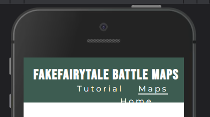
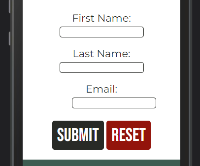

# Testing

## Code Validation
In order to properly test the FakeFairytale Battle Maps website it has to be run through the W3C HTML Validator and W3C CSS Validator respectively. No error were encountered during this process as some had already been addressed during an earlier stage of the development process. The CSS Validation passed without errors during it's first validation.

### HTML

**Home**  

**Confirmation page**  

**Tutorial**  

**Maps**  

### CSS
**CSS**  

## Responsiveness

|             | Iphone 5 | Moto G4 | iPhone 6 | iPhone 12 pro | iPad mini | iPad Air | Display <1300px | Display 1920px  | Display 2560px  | Display 4k      |
|-------------|----------|---------|----------|---------------|-----------|----------|-----------------|-----------------|-----------------|-----------------|
| Navigation  | fail     | pass    | pass     | pass          | pass      | pass     | pass            | pass            | pass            | fail            |
| Images      | pass     | pass    | pass     | pass          | pass      | pass     | pass            | pass            | pass            | pass            |
| Videoplayer | pass     | pass    | pass     | pass          | pass      | pass     | pass            | pass            | pass            | pass            |
| Links       | pass     | pass    | pass     | pass          | pass      | pass     | pass            | pass            | pass            | pass            |
| Form        | fail     | pass    | pass     | pass          | pass      | pass     | pass            | pass            | pass            | pass            |
|-------------|----------|---------|----------|---------------|-----------|----------|-----------------|-----------------|-----------------|-----------------|
| Width in px | 320px    | 360px   | 375px    | 390px         | 768px     | 820px    | 950 to 1300px   | 1920px          | 2560px          | 4000px          |

During testing on a wide variety of screen sizes it wwas noted that the website degrades in quality in screens smaller than 350px and wider than 4k. The webstie remains usuable and it's structural integrity mostly intacts. However, some elements start to position in strange places as illustraded below.

### <350px Screens
The main issue on smaller than 350px screens in that the navigation menu no-longer fits in the top bar. Additionally, the email field in the sign-up form shifts to the right and the confirmation screen text isn't perfectly aligned to the center of the screen. Please consult the [Unresolved bugs](<#unresolved>) section for suggestions on how this could be addressed.

 

  

### Above 4k Screens
The main issue is that the footer move up from the bottom of the screen. Please consult the [Unresolved bugs](<#unresolved>) section for suggestions on how this could be addressed.

## Browser Compatibility
The testing process has been repeated over multiple browsers and the results come out the same for each Chrome, Mozilla, Safari, Edge. All features funciton as intended and responsiveness is consitent in all tracked aspect.

## User Story Testing

## Known Bugs

### Resolved

### Unresolved

## Lighthouse Testing