# Testing

## Code Validation
In order to properly test the FakeFairytale Battle Maps website it has to be run through the [W3C HTML Validator](https://validator.w3.org/) and [W3C CSS Validator](https://jigsaw.w3.org/css-validator/) respectively. No errors were encountered during this process. Both the HTML and CSS Validation passed without errors during it's first validation.

### HTML

**Home**  
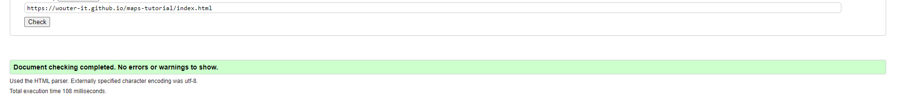

**Confirmation page**  
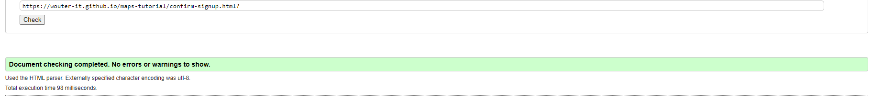

**Tutorial**  
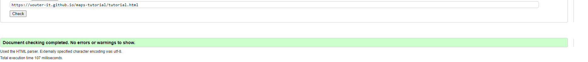

**Maps**  
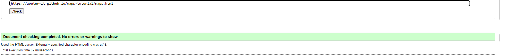

### CSS
**CSS Validation**  
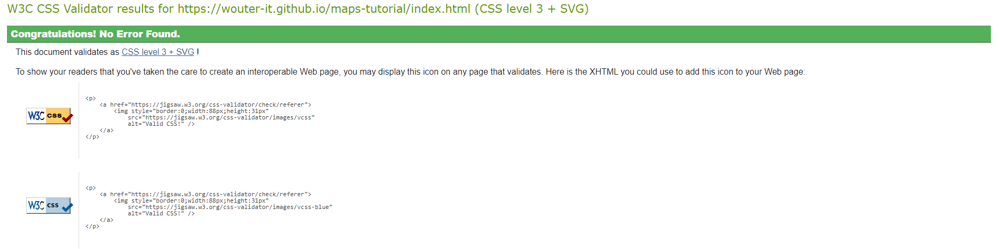

### Chrome Console Error

During testing a Chrome console error was found. After some research a thread on STack Overflow confirmed this has nothing to do with the code but simply because Chrome added support for Sourcemaps. When disableing JavaScript source maps and CSS source maps in the setting of the CHrome dev tools the issue should resolve itself.

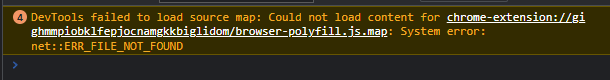

Also note that having an Ad-blocker active may cause errors in the console due to it blocking ads on the Youtube Video's embedded in the website.

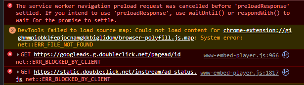

Last but not least, in the deployed verison of the site the eroor below pops up. This is cause by github.io disabled support for FLoC by default. It does not influence website performance in any way according to [PositionIsEverything](https://www.positioniseverything.net/error-with-permissions-policy-header-unrecognized-feature-interest-cohort./). The error message can be prevented by disabling FLoC in Chrome.

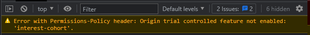

## Responsiveness

|             | Iphone 5 | Moto G4 | iPhone 6 | iPhone 12 pro | iPad mini | iPad Air | Display <1300px | Display 1920px  | Display 2560px  | Display 4k      |
|-------------|----------|---------|----------|---------------|-----------|----------|-----------------|-----------------|-----------------|-----------------|
| Navigation  | fail     | pass    | pass     | pass          | pass      | pass     | pass            | pass            | pass            | fail            |
| Images      | pass     | pass    | pass     | pass          | pass      | pass     | pass            | pass            | pass            | pass            |
| Videoplayer | pass     | pass    | pass     | pass          | pass      | pass     | pass            | pass            | pass            | pass            |
| Links       | pass     | pass    | pass     | pass          | pass      | pass     | pass            | pass            | pass            | pass            |
| Form        | fail     | pass    | pass     | pass          | pass      | pass     | pass            | pass            | pass            | pass            |
| Width       | 320px    | 360px   | 375px    | 390px         | 768px     | 820px    | 950 to 1300px   | 1920px          | 2560px          | 4000px          |

During testing on a wide variety of screen sizes it was noted that the website degrades in quality in screens smaller than 350px and wider than 4k. The website remains usuable and its structural integrity mostly intacts. However, some elements start to position in strange places as illustraded below.

### <350px Screens
The main issue on smaller than 350px screens in that the navigation menu no-longer fits in the top bar. Additionally, the email field in the sign-up form shifts to the right and the confirmation screen text isn't perfectly aligned to the center of the screen. Please consult the [Unresolved bugs](<#unresolved>) section for suggestions on how this could be addressed.

 

  

### Above 4k Screens
The main issue is that the footer move up from the bottom of the screen. Please consult the [Unresolved bugs](<#unresolved>) section for suggestions on how this could be addressed.

## Browser Compatibility
The testing process has been repeated over multiple browsers and the results come out the same for each Chrome, Mozilla, Safari, Edge. All features function as intended and responsiveness is consitent in all tracked aspect.

## User Story Testing
- As a visitor, I want to immediately understand the purpose of the website upon loading. 
  - Upon loading the homepage the visitor is greeted with textbox stating the purpose of the website: Become a better map-maker in Dungeondraft.

- As a visitor, I want to be able to navigate through the site conveniently.
  - A navigation bar is available on every page at the top of the screen.
  - The FakeFairytale logo also links back to the homepage.
  - On the homepage there are two quick navigation buttons that get the visitor to the page they want without having to scroll up.

- As a visitor, I want to see what kind of content FakeFairytale creates.
  - On every main page of the website there is a type of content that FakeFairytale creates, hero image and video on the home-page, tutorial and tutorial video on the tutorial page, maps on the maps page. 

- As a visitor, I want to have material to improve my map-making skills at my disposal.
  - The home screen has a welcome text-box to reassure the visitor they are on a page where they can find support for map-making.
  - The homepage has a video giving 15 tips to the viewer on how to improve.
  - On the Tutorials page there is a video explaining the basics, which is part of a video series. The visitor has the opportunity to view the entire series without leaving the website.

- As a visitor, I want to know how to purchase DD.
  - A step by step tutorial on the Tutorial page explains how to go about the process of purchasing Dungeondraft.

- As a visitor, I want to be able to contact FakeFairytale.
  - Links to all social media and the email address are stated in the footer.
  - A visitor can navigate to the FakeFairytale YouTube page through one of the videos on the website.

- As a visitor, I want to be able to find more videos & tutorials.
  - Upon reaching the end of a video, the FakeFairytale channel automatically recommends multiple videos the visitor can watch.
  - A link to the YouTube Channel can be found in the footer.

- As a visitor, I want to download maps made by FakeFairytale.
  - On the Maps page there are 6 maps available to download immediately. 

## Known Bugs
### Resolved
During development multiple bugs were encountered and resolved.

- There was a bug causing the hero image to not fully display on larger screen sizer. This was resolved, through the use of chrome devtools, that after removing the overflow: hidden property from the hero image the issues dispapeared. The overflow was being hidden.

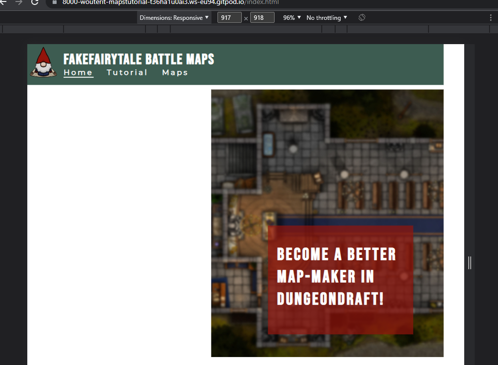

- There was an issue with divs exceeding the boundries of the screen, causing some elements to disappear. It was resolved by giving the section they were in a set width of 100%, and the about-text box a width of 85% so the divs inside it would move closer to the center of the screen. The text was then centered with margin 0 auto.

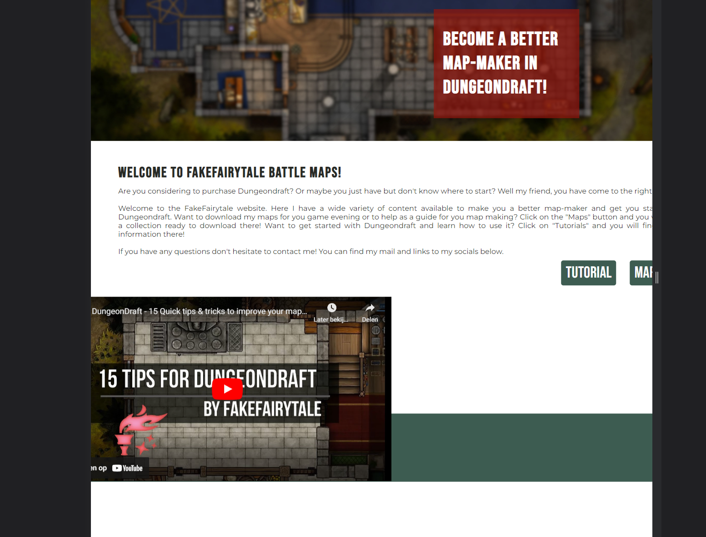

- On smaller devices of <450px the quick nav buttons appeared on top of each other and aligned to their right side. The issue was caused by their container being too small in width to contain both buttons. Reducing the size of the buttons resolved the issue.

- The Maps page encountered a strange alignment issue on screens smaller than 950px although the text was aligned to center. It appeared to be pushed to the right by some element in the page header. The bug was resolved by adding more margin to the top of the h2 element.

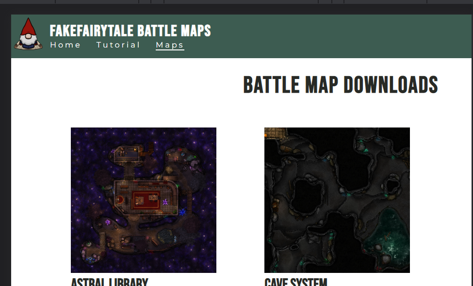

- On apperantly random screensizes white lines appear around the div contained the email address at the bottom of the page as illustrated in the image below. This was tackeled by increasing the size of the footers height.

### Unresolved

**Navigation breaking on smaller than 350px screens**
- On 350px or smaller screens the navigation menu no longer fist in the header of the page as illustrated in the [images above](<#responsiveness>) in the responsiveness chapter. This issue can be resolved by reducing the header size slightly on screens below 350px width size.

**Form email field & confirmation page**
- On 350px or smaller screens the email field no longer aligns with the other fields as illustrated in the [images above](<#responsiveness>) in the responsiveness chapter. This can be fixed by resetting some margins to the left, or simply by centralising the field.

**Floating footer on larger screens**
- The footer of the webpage has not been hard-coded to stick to the bottom of the screen as illustrated in the [images above](<#responsiveness>) in the responsiveness chapter. Using position: absolute bottom 0 wil in most cases resolve this issue. 

## Lighthouse Testing

During some additional testing using the Lighthouse functionality in the Chrome devtools it was confirmed that the changes to the images on the website, being altered from full PNG's to small webp files, has the desired effect. Outside of that the webpage scored green accross the board as well.

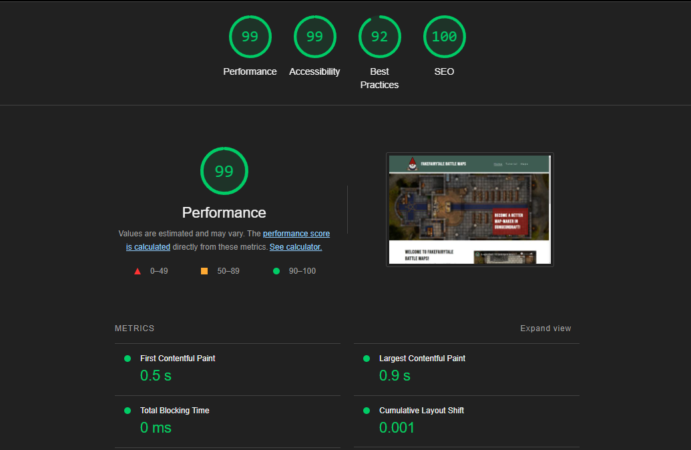

[**Go Back to README**](README.md)